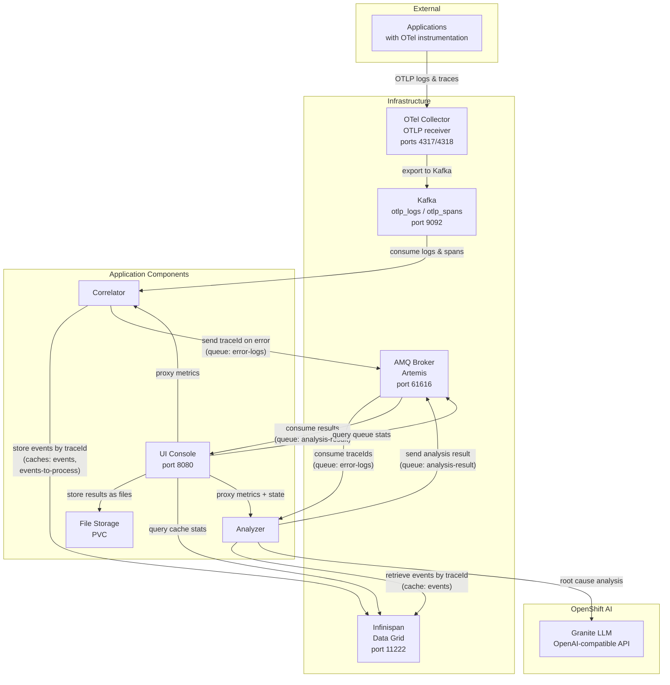
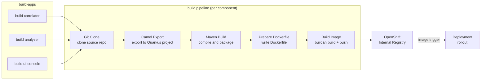

# Smart Telemetry Pipeline

An intelligent observability pipeline that automatically detects microservice errors in distributed applications, correlates logs and traces, and uses GenAI to provide SREs with actionable remediation steps. Built with OpenTelemetry, Kafka, Camel, Artemis, Infinispan and LLMs to dramatically reduce MTTR via AI-assisted diagnostics.

## Table of contents

1. [Architecture](#architecture)
2. [Build Pipeline](#build-pipeline)
3. [Requirements](#requirements)
4. [Get Access to the Developer Sandbox](#get-access-to-the-developer-sandbox)
5. [Install the CLI Tools](#install-the-cli-tools)
6. [Log In to the Cluster](#log-in-to-the-cluster)
7. [Clone This Repository](#clone-this-repository)
8. [Quick Start](#quick-start)
9. [Deploy the Infrastructure](#deploy-the-infrastructure)
10. [Configure OpenAI Credentials](#configure-openai-credentials)
11. [Deploy Applications with Helm](#deploy-applications-with-helm)
12. [Build Application Images](#build-application-images)
13. [Verify the Installation](#verify-the-installation)
14. [Troubleshooting](#troubleshooting)
15. [Delete](#delete)

## Detailed description

The system consists of three Apache Camel applications that form an automated error analysis pipeline:

- The **correlator** consumes OpenTelemetry logs and spans from Kafka, correlates them by traceId in Infinispan, and detects errors. When cached events expire (after a configurable TTL), the traceId is forwarded to a JMS queue for analysis.

- The **analyzer** picks up traceIds from the JMS queue, retrieves the correlated events from Infinispan, sends them to an LLM (OpenAI-compatible API) for root cause analysis, and publishes the result to an output queue.

- The **ui-console** consumes analysis results, stores them as files, and exposes a REST API and web UI for listing results, viewing trace details, and triggering interactive re-analysis with custom prompts.

### Architecture diagrams



The `build` pipeline converts Camel JBang source code into container images deployed on OpenShift:



The **Camel Export** step runs `camel export --runtime=quarkus` to convert the Camel JBang application into a standard Quarkus Maven project. The **Maven Build** step compiles it into a Quarkus fast-jar. The **Build Image** step uses Buildah to create the container image and push it to the OpenShift internal registry. The `image.openshift.io/triggers` annotation on the Deployment automatically triggers a rollout when a new image is pushed.

## Requirements

### Minimum hardware requirements

No dedicated hardware is required. The application runs entirely within the Red Hat Developer Sandbox, which provides shared compute resources.

### Minimum software requirements

- [Red Hat Developer Sandbox](https://developers.redhat.com/developer-sandbox) (OpenShift with Pipelines pre-installed)
- OpenShift AI shared models activated in the sandbox (Granite LLM)

### Required user permissions

Regular sandbox user permissions (no cluster-admin required). All components are deployed as containers within the user's namespace.

## Get Access to the Developer Sandbox

The Red Hat Developer Sandbox provides a free OpenShift cluster with a pre-provisioned namespace. Key characteristics:

- **No cluster-admin access** -- you cannot install cluster-wide operators or create ClusterRoles
- **Pre-installed operators** -- OpenShift Pipelines (Tekton) is available; other components are deployed as containers
- **Pre-provisioned namespace** -- you use your assigned `<username>-dev` namespace
- **Resource quotas** -- CPU and memory are limited
- **Idle timeout** -- pods may be scaled down after inactivity
- **30-day access** -- the sandbox expires after 30 days (you can re-register)

1. Go to [https://developers.redhat.com/developer-sandbox](https://developers.redhat.com/developer-sandbox)
2. Click **Start your sandbox for free** and log in with your Red Hat account
3. Complete the registration (phone verification may be required)
4. Once provisioned, click **Start using your sandbox** to open the OpenShift web console
5. In the sandbox landing page, find the **OpenShift AI** card and click **Try it** to activate the shared LLM inference services (Granite models). This provisions the models in the `sandbox-shared-models` namespace, which the analyzer component uses for root cause analysis

## Install the CLI Tools

You need the `oc` and `helm` CLIs on your local machine. The `tkn` CLI is optional but useful for monitoring pipeline runs.

### oc (OpenShift CLI)

Download from the OpenShift web console:

1. In the web console, click the **?** icon in the top-right corner
2. Select **Command line tools**
3. Download the `oc` binary for your OS and add it to your `PATH`

Alternatively, download from [mirror.openshift.com](https://mirror.openshift.com/pub/openshift-v4/clients/ocp/latest/).

### helm

```bash
# Linux
curl -fsSL https://raw.githubusercontent.com/helm/helm/main/scripts/get-helm-3 | bash

# macOS
brew install helm

# Windows (with Chocolatey)
choco install kubernetes-helm
```

Or follow the [official install guide](https://helm.sh/docs/intro/install/).

### tkn (optional)

```bash
# Linux
curl -LO https://mirror.openshift.com/pub/openshift-v4/clients/pipelines/latest/tkn-linux-amd64.tar.gz
tar xvf tkn-linux-amd64.tar.gz -C /usr/local/bin/ tkn

# macOS
brew install tektoncd-cli
```

Or follow the [official install guide](https://tekton.dev/docs/cli/).

## Log In to the Cluster

1. In the OpenShift web console, click your username in the top-right corner
2. Select **Copy login command**
3. Click **Display Token**
4. Copy the `oc login` command and run it in your terminal:

   ```bash
   oc login --token=sha256~XXXX --server=https://api.sandbox-XXXX.openshiftapps.com:6443
   ```

5. Verify your namespace:

   ```bash
   oc project
   ```

   You should see something like `<username>-dev`. This is your working namespace for all subsequent commands.

6. Store your namespace name for later use:

   ```bash
   export NS=$(oc project -q)
   echo "Using namespace: ${NS}"
   ```

## Clone This Repository

```bash
git clone https://github.com/rh-ai-quickstart/smart-telemetry-pipeline.git
cd smart-telemetry-pipeline
```

## Quick Start

Two scripts automate the full installation and cleanup. They follow the same steps described in the sections below.

```bash
# Install everything (infrastructure, applications, build images)
./create.sh

# Remove everything
./delete.sh
```

If you prefer to run each step manually, follow the sections below.

## Deploy the Infrastructure

Only OpenShift Pipelines (Tekton) is pre-installed in the Developer Sandbox. Other operators (Data Grid, AMQ Broker, AMQ Streams) cannot be installed due to sandbox restrictions on cluster-scoped resources, so all infrastructure components are deployed as plain containers.

### Apply secrets and ConfigMaps

```bash
oc apply -f deploy/resources/secrets/
oc apply -f deploy/resources/configmaps/
```

### Deploy the OpenTelemetry infrastructure (Kafka + OTel Collector)

Deploy Kafka and an OpenTelemetry Collector that receives OTLP logs and traces and exports them to Kafka.

**Deploy Kafka:**

```bash
oc apply -f deploy/resources/otel-infra/kafka/kafka-sandbox.yaml
```

**Deploy the OpenTelemetry Collector via Helm:**

```bash
helm repo add open-telemetry https://open-telemetry.github.io/opentelemetry-helm-charts
helm repo update

helm install camel-otel-collector open-telemetry/opentelemetry-collector \
  -f deploy/resources/otel-infra/otel-collector/values-sandbox.yaml \
  -n "${NS}" --wait --timeout 300s
```

### Deploy Infinispan (Data Grid)

```bash
oc apply -f deploy/resources/infinispan/infinispan-sandbox.yaml

# Wait for it to be ready
oc wait deployment/infinispan --for=condition=Available --timeout=180s
```

Create the caches:

```bash
ISPN_POD=$(oc get pod -l app=infinispan -o jsonpath='{.items[0].metadata.name}')

for CACHE_FILE in deploy/resources/infinispan/caches/*.json; do
  CACHE_NAME=$(basename "${CACHE_FILE}" .json)
  echo "Creating cache '${CACHE_NAME}'..."
  oc exec "${ISPN_POD}" -- curl -s \
    -u admin:password --digest \
    -X POST "http://localhost:11222/rest/v2/caches/${CACHE_NAME}" \
    -H 'Content-Type: application/json' \
    -d "$(cat "${CACHE_FILE}")"
  echo ""
done
```

### Deploy AMQ Broker

```bash
oc apply -f deploy/resources/amq-broker/artemis-sandbox.yaml

# Wait for it to be ready
oc wait deployment/artemis --for=condition=Available --timeout=180s
```

### Create infra-endpoints ConfigMap

```bash
oc create configmap infra-endpoints \
  --from-literal=ARTEMIS_BROKER_URL="tcp://artemis.${NS}.svc:61616" \
  --from-literal=INFINISPAN_HOSTS="infinispan.${NS}.svc:11222" \
  --dry-run=client -o yaml | oc apply -f -
```

## Configure OpenAI Credentials

The analyzer component requires access to an OpenAI-compatible API for root cause analysis. The default credentials in `deploy/resources/secrets/openai.yaml` point to a local Ollama instance.

### Using OpenShift AI models on Developer Sandbox

The Developer Sandbox provides shared LLM inference services (e.g. Granite) in the `sandbox-shared-models` namespace. These endpoints use the OpenShift service serving CA for TLS and require an OpenShift authentication token.

**1. Identify the model endpoint:**

List the available inference services:

```bash
oc get inferenceservice -n sandbox-shared-models
```

The endpoint URL follows the pattern:
`https://<service-name>-predictor.sandbox-shared-models.svc.cluster.local:8443/v1`

**2. Create the secret with a ServiceAccount token:**

The model endpoint requires an OpenShift authentication token instead of a traditional API key. Generate a long-lived token from your namespace's `default` ServiceAccount:

```bash
SA_TOKEN=$(oc create token default --duration=120h)

oc create secret generic openai \
  --from-literal=OPENAI_API_KEY="${SA_TOKEN}" \
  --from-literal=OPENAI_BASE_URL="https://isvc-granite-31-8b-fp8-predictor.sandbox-shared-models.svc.cluster.local:8443/v1" \
  --from-literal=OPENAI_MODEL="isvc-granite-31-8b-fp8" \
  --dry-run=client -o yaml | oc apply -f -
```

> **Note:** The token expires after the specified duration (5 days in this example). Regenerate it and update the secret when it expires.

**3. Trust the OpenShift service CA:**

The model endpoint uses a TLS certificate signed by the OpenShift service serving CA, which is not in the default JVM truststore. Create a ConfigMap with the `inject-cabundle` annotation -- OpenShift automatically populates it with the service CA certificate. The Helm chart handles the rest (an init container builds a JVM truststore from the injected CA at pod startup).

```bash
oc create configmap service-ca-bundle
oc annotate configmap service-ca-bundle \
  service.beta.openshift.io/inject-cabundle=true
```

> **Note:** This ConfigMap must be created **before** installing the Helm chart. The analyzer deployment references it via the `serviceCa` configuration in `values.yaml`.

### Using an external OpenAI-compatible API

For external providers (OpenAI, Ollama, etc.) that use publicly trusted TLS certificates, only the secret is needed -- no truststore configuration:

```bash
oc create secret generic openai \
  --from-literal=OPENAI_API_KEY="<your-api-key>" \
  --from-literal=OPENAI_BASE_URL="https://api.openai.com/v1" \
  --from-literal=OPENAI_MODEL="gpt-4o-mini" \
  --dry-run=client -o yaml | oc apply -f -
```

## Deploy Applications with Helm

Deploy the Helm chart:

```bash
helm install smart-log-analyzer chart/ \
  --set namespace="${NS}" \
  -n "${NS}"
```

To upgrade after changes:

```bash
helm upgrade smart-log-analyzer chart/ \
  --set namespace="${NS}" \
  -n "${NS}"
```

## Build Application Images

Apply the Tekton tasks and pipeline:

```bash
oc apply -f deploy/tasks/
oc apply -f deploy/pipeline/
```

Build all three components (correlator, analyzer, ui-console) with a single pipeline:

```bash
tkn pipeline start build-apps \
  -p namespace="${NS}" \
  --use-param-defaults \
  --showlog
```

The `build-apps` pipeline starts three parallel `build` pipeline runs (one per component) and waits for all of them to complete. Use `--showlog` to follow the progress in real time.

> **Note:** The `namespace` parameter must match your sandbox namespace so that images are pushed to the correct ImageStream.

Once the images are pushed to the internal registry, the `image.openshift.io/triggers` annotation on the Deployments will automatically trigger a rollout.

Optionally, clean up completed pipeline and task runs to free resources (the sandbox has a limit of 30 ReplicaSets):

```bash
oc delete pipelinerun --all
oc delete taskrun --all
oc get rs --no-headers | awk '$2==0 && $3==0 && $4==0 {print $1}' | xargs -r oc delete rs
```

## Verify the Installation

1. **Check that all pods are running:**

   ```bash
   oc get pods
   ```

   You should see pods for:
   - `kafka-*` (Kafka)
   - `infinispan-*` (Data Grid)
   - `artemis-*` (AMQ Broker)
   - `camel-otel-collector-*` (OTel Collector)
   - `correlator-*` (application)
   - `analyzer-*` (application)
   - `ui-console-*` (application)

2. **Check the UI Console route:**

   ```bash
   oc get route ui-console -o jsonpath='https://{.spec.host}{"\n"}'
   ```

   Open the URL in your browser to access the UI Console.

3. **Check pipeline runs:**

   ```bash
   tkn pipelinerun list
   ```

4. **Check secrets:**

   ```bash
   oc get secret infra-accounts openai
   ```

## Troubleshooting

### Resource Quota Exceeded

The sandbox has CPU and memory quotas. If pods are stuck in `Pending`:

```bash
oc describe resourcequota
oc get pods -o custom-columns=NAME:.metadata.name,MEM:.spec.containers[0].resources.limits.memory
```

Reduce memory limits and re-deploy:

```bash
helm upgrade smart-log-analyzer chart/ \
  --set namespace="${NS}" \
  -n "${NS}"
```

### Pods Scaled Down After Inactivity

The sandbox may idle pods after a period of inactivity. Access the route or run `oc get pods` to wake them up. If pods don't restart:

```bash
oc rollout restart deployment correlator analyzer ui-console
```

### Pods CrashLooping with Missing Secrets

Ensure the required secrets exist:

```bash
oc get secret infra-accounts openai
```

If missing, re-apply them:

```bash
oc apply -f deploy/resources/secrets/
```

### Image Pull Errors

Make sure the build pipeline completed successfully and pushed the images:

```bash
oc get is
```

Each ImageStream (correlator, analyzer, ui-console) should have a `latest` tag.

## Delete

To remove everything:

```bash
# Uninstall the Helm release
helm uninstall smart-log-analyzer

# Delete infrastructure
helm uninstall camel-otel-collector --ignore-not-found
oc delete -f deploy/resources/otel-infra/kafka/kafka-sandbox.yaml --ignore-not-found
oc delete -f deploy/resources/infinispan/infinispan-sandbox.yaml --ignore-not-found
oc delete -f deploy/resources/amq-broker/artemis-sandbox.yaml --ignore-not-found

# Delete all pipeline resources
oc delete pipelinerun --all
oc delete taskrun --all
oc delete pipeline --all
oc delete task --all

# Delete built image streams
oc delete is correlator analyzer ui-console --ignore-not-found

# Delete remaining resources
oc delete configmap infra-endpoints otel-infra-endpoints base-image-config-quarkus service-ca-bundle --ignore-not-found
oc delete secret infra-accounts openai service-ca-truststore --ignore-not-found
```

Or use the cleanup script:

```bash
./delete.sh
```

## References

- [Apache Camel](https://camel.apache.org/)
- [Camel JBang](https://camel.apache.org/manual/camel-jbang.html)
- [Red Hat Developer Sandbox](https://developers.redhat.com/developer-sandbox)
- [OpenTelemetry](https://opentelemetry.io/)

## Tags

<!--
Title: Smart Telemetry Pipeline
Description: AI-powered observability pipeline that detects errors, correlates logs and traces, and provides automated root cause analysis
Industry: Technology
Product: OpenShift AI
Use case: observability, automation, AI-assisted diagnostics
Contributor org: Red Hat
-->
